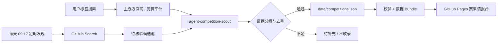

<div align="center">

# Agent 赛事观测站

### 让每一条赛果，都能回到它的原始来源。

面向 AI Agent、Agent Skill、MCP 与多智能体比赛的公开赛果情报站<br>
**官方来源优先 · 奖项口径不混排 · 核验日期可追溯**

`纯静态`　`零前端依赖`　`GitHub Pages`　`内置联网核验 Skill`

[在线访问](https://carpentry-liu.github.io/agent-skill-podium/) · [浏览赛果](#功能) · [使用发现台](#标签化发现) · [安装 Skill](#agent-competition-scout-skill) · [提交比赛](CONTRIBUTING.md)

</div>

> [打开在线观测站](https://carpentry-liu.github.io/agent-skill-podium/) 查看真实运行界面。新版采用“夜间观测台”视觉系统：深蓝数据面板、荧光信号坐标与高对比雷达区，仍可由 GitHub Pages 原样托管。

它不制造新的“综合排行榜”，而是把散落在主办方博客、赛事官网和官方竞赛页里的获奖信息，整理成可搜索、可筛选、可追溯的数据集。仓库同时包含可安装的 `agent-competition-scout` Skill，用来联网发现候选赛事、核验官方证据并维护数据。

| 数据快照 | 已收录赛事 | 获奖记录 | 主办组织 | 最近核验 |
| --- | ---: | ---: | ---: | --- |
| `v1.1` | 11 | 54 | 10 | 2026-09-04 |

## 为什么需要它

AI 爆发后，企业、社区和平台举办了大量 Agent / Skill 比赛，但了解赛果仍然很费时间：

- 结果散落在不同主办方网站，搜索关键词和页面结构没有统一标准；
- 有的赛事按总排名，有的按地区、赛道或专项奖，不能简单混成一个 Top 3；
- 项目 README、社交媒体和二手盘点常常只写“获奖”或“入围”，难以判断证据强度；
- 比赛结束后链接会迁移、结果会补发，缺少核验日期就不知道信息有多新；
- 单纯自动抓取很容易把搜索摘要、参赛者自述或页面顺序误当正式名次。

这个项目把“发现”和“确认”拆开：定时任务每天生成新的候选线索，网页让人快速搜索，Skill 负责做需要判断力的官方核验，结构化数据保存结果，网页再以统一界面呈现。



## 功能

### 赛果浏览

- 按关键词搜索赛事、项目、团队、用途与标签；
- 按主办方、年份、类型和赛果状态筛选，并按年份、获奖记录数量或主办方排序；
- 展示官方奖项原文、明确数字名次、获奖项目与团队；
- 提供项目链接、官方结果来源和最近核验日期；
- 区分“已核验”“已核验·精选”和“待开奖”；
- 对缺少项目链接、规模数据或结果的情况明确显示待补充；
- 无搜索结果时提供可恢复的空状态。

### 标签化发现

发现区分成两层：

1. **每日候选池**：GitHub Actions 每天 09:17（北京时间）调用 GitHub Search API。任务使用 Agent、Skill、MCP、多智能体以及“黑客松 / 大赛 / 挑战赛”等中英文组合，更新 [`data/discovery.json`](data/discovery.json) 和网页数据包；
2. **交互搜索台**：用户继续组合主题、行业、主办方、地区和年份标签，跳转到官方域名、GitHub、Devpost、Kaggle 等入口做针对性搜索。

自动候选统一标记为“待核验”。它可能是主办仓库、参赛项目或只提到赛事的仓库，**绝不会因为自动发现就进入正式赛果目录**。只有核验到主办方身份、官方奖项和获奖者后，维护者才会写入 `data/competitions.json`。

发现台支持组合以下标签：

- 主题：Agent、Skill、MCP、multi-agent、安全、智能攻防；
- 行业：医疗、企业协作、开发者工具、教育、可持续、生活服务、游戏、网络安全、AI PC；
- 主办方：Google Cloud、Microsoft、AWS、OpenAI、火山引擎、扣子、字节跳动、腾讯云、阿里云、魔搭；
- 年份与地区：2024–2026、全球、中国大陆、中国、北美、亚太、日本。

组合后的查询可以跳转到可配置的搜索入口：全球主办方官网、中国大陆主办方官网、火山引擎 / 扣子、腾讯云、阿里云 / 魔搭、GitHub、Devpost、Kaggle 和 Hugging Face。配置位于 [`data/competitions.json`](data/competitions.json) 的 `discovery` 字段。

> 浏览器本身不抓取外部网站。每日候选由 GitHub Actions 在服务端定时生成并直接重新部署 Pages；因此访客每天能看到更新后的线索，同时正式赛果仍保持人工 / Skill 核验门槛。

### Agent Competition Scout Skill

仓库根目录本身就是一个可安装 Skill：

- 从标签和用户问题生成多组联网查询；
- 优先主办方官网、官方博客、官方赛事页和官方 GitHub；
- 把来源分为 A–D 级，参赛者自述和二手榜单只作为线索；
- 区分数字名次、大奖、地区奖、类别奖和荣誉提名；
- 按主办方、赛事、届次和官方链接去重；
- 将无法确认的字段保留为 `null` 或“待补充”；
- 更新 JSON 后生成离线数据 Bundle，并运行结构与行为测试；
- 输出新增、跳过、待确认项和证据等级组成的核验回执。

安装到某个项目：

```powershell
git clone https://github.com/carpentry-liu/agent-skill-podium.git .codex/skills/agent-competition-scout
```

然后可以这样使用：

```text
使用 $agent-competition-scout 搜索 2026 年 Agent 安全和 MCP 比赛，先做只读报告，不修改数据。
```

```text
使用 $agent-competition-scout 核验最近公布的官方前三名，更新领奖台数据并给出验证回执。
```

Skill 的入口和判定口径分别位于 [`SKILL.md`](SKILL.md) 与 [`references/source-policy.md`](references/source-policy.md)。

## 当前数据

截至 2026-08-31，数据集收录 11 场比赛、54 条获奖记录。下面所有获奖人、团队和作品均能回溯到主办方材料；尚未开奖的赛事不会显示虚构名单。

### 中国大陆

- [魔搭 · AI PC Agent Skills 征文活动](https://modelscope.cn/events/242/AI%20PC%20Agent%20Skills%20%E5%BE%81%E6%96%87%E6%B4%BB%E5%8A%A8)：收录官方公布的全部 10 组最佳实践奖；官方注明排名不分先后，数据不写数字名次；
- [腾讯云 · 第二届黑客松智能渗透挑战赛](https://developer.cloud.tencent.com/article/2661083)：只收录官方复盘正文明确点名的主赛场冠军与平行赛场第一名；
- [火山引擎 / 扣子 · Vibe Coze 企业 AI 应用赛道](https://developer.volcengine.com/activities/7569894904566906907)：新增全部 12 个获奖作品及选手，包括《企业产品海报设计工具 PC 版》《销冠武器库》《企业合规风险检测助手》等；
- [阿里云 / 魔搭 / Datawhale · Create@AI 创客松第四季](https://startup.aliyun.com/info/1083843.html)：新增 10 个 Multi-Agent 获奖作品及团队成员，包括《再忙也要陪陪小朋友》《AI创意广告制造局》《ChaosAgent 混沌工程助手》等；
- [火山引擎 / 扣子 · AI 智能体线上挑战赛](https://developer.volcengine.com/activities/7413321752799150117)：精选官方获奖表的一等奖与全部二等奖，不把同档奖项强行排序；
- [火山引擎 · 火山杯 Agent 创新大赛 2026](https://www.volcengine.com/activity/agent/competition/2026)：赛事进行中，全国总决赛和获奖名单尚未公布。

### 全球与其他地区

- [OpenAI · The WebMCP Challenge](https://openai.com/webmcp-challenge/)：仍在征集，赛果待公布；
- [Microsoft · Agent Academy Hackathon Winners](https://devblogs.microsoft.com/powerplatform/agent-academy-hackathon-winners/)；
- [Google Cloud · Gemini Live Agent Challenge Winners](https://cloud.google.com/blog/topics/developers-practitioners/winners-and-highlights-of-the-gemini-live-agent-challenge)；
- [Google Cloud · ADK Hackathon Winners](https://cloud.google.com/blog/products/ai-machine-learning/adk-hackathon-results-winners-and-highlights)；
- [AWS · Summit Japan 2025 生成 AI Agent Hackathon](https://aws.amazon.com/jp/blogs/news/aiagent_hackathon_report/)。

收录不代表赛事全量覆盖。阿里云、魔搭、腾讯云、火山引擎等搜索入口可以帮助继续发现候选项，但只有官方页面明确给出获奖者时才会进入数据集；每场赛事的 `verification_note` 会说明当前是完整奖单、主要奖项精选，还是待开奖。

## 数据可信度

| 等级 | 是否可证明名次 | 来源 |
| --- | --- | --- |
| A | 是 | 主办方官网或官方博客直接列出奖项与获奖者 |
| B | 是 | 能确认主办方身份的官方竞赛结果页 |
| C | 有条件 | 主办方维护的 GitHub 或官方社交公告，需要说明为何缺少更强来源 |
| D | 否 | 参赛者 README、个人主页、二手盘点、搜索摘要、点赞或 Star |

项目链接用于了解作品，不单独承担名次证明。数据不会根据奖金额度、页面顺序、项目热度或 Finalist 身份推断排名。

## 本地运行

无需安装前端依赖，直接打开 `index.html` 即可浏览。也可以启动本地静态服务器：

```powershell
python -m http.server 8000
```

然后访问 `http://localhost:8000`。

直接打开文件时，浏览器读取生成的 `data/competitions.js`；JSON 仍是唯一维护源。

## 一条命令维护

所有同步、校验和测试统一从 `scripts/maintain.py` 进入，不必再记五条命令：

| 目的 | 命令 | 是否写文件 |
| --- | --- | --- |
| 提交前完整检查 | `python scripts/maintain.py check` | 否 |
| 编辑正式赛果后的同步与检查 | `python scripts/maintain.py refresh` | 只生成 `competitions.js` |
| 预演同步 | `python scripts/maintain.py refresh --dry-run` | 否 |
| 联网预览新候选 | `python scripts/maintain.py discover --dry-run` | 否 |
| 更新每日候选池 | `python scripts/maintain.py discover --write-leads` | 只写 `discovery.json/js` |

每次命令都会输出 Markdown 风格的可读报告：文件是否变化、每个步骤是否通过，以及候选仍为 `unverified` 的证据边界。需要留档时增加 `--report reports/maintenance.md`。报告只能写入仓库专用的 `reports/` 目录、必须使用新的 `.md` 文件名且不会覆盖旧报告；`data/`、脚本目录与仓库外路径会在任何发现或同步动作开始前被拒绝。

```powershell
# 典型流程：编辑 data/competitions.json 后，一条命令完成其余工作
python scripts/maintain.py refresh --report reports/maintenance.md
```

自动发现只查询公开的 GitHub Search，不会在网页端抓取，不需要把密钥放进仓库，也**不会**把候选自动写进正式赛果。维护者核对到官方结果证据后，才人工编辑 `data/competitions.json`。

校验器只使用 Python 标准库；正式 JSON Schema 位于 [`data/competitions.schema.json`](data/competitions.schema.json)。贡献新的赛事前，请阅读 [`CONTRIBUTING.md`](CONTRIBUTING.md) 和 [`references/data-schema.md`](references/data-schema.md)。

## 技术与设计

- 原生 HTML、CSS、JavaScript，无框架、无生产构建依赖；
- GitHub Pages 可直接托管；
- 克制的比价目录视觉：海军蓝可信主色、琥珀重点色、绿色核验状态与分区浅色背景；
- 响应式布局、键盘焦点、跳转链接、ARIA live 区域和 reduced-motion 支持；
- 所有动态内容通过 DOM 文本节点写入，避免将数据直接拼成 HTML；
- Python 标准库负责数据 schema、URL、日期、重复 ID、奖项状态和 Bundle 同步校验。

## 贡献

欢迎补充官方赛事、纠正链接或更新待开奖项目。每个 PR 必须给出能直接证明奖项的官方来源，并说明核验日期和覆盖口径。详细步骤见 [`CONTRIBUTING.md`](CONTRIBUTING.md)。

## License

[MIT](LICENSE)
