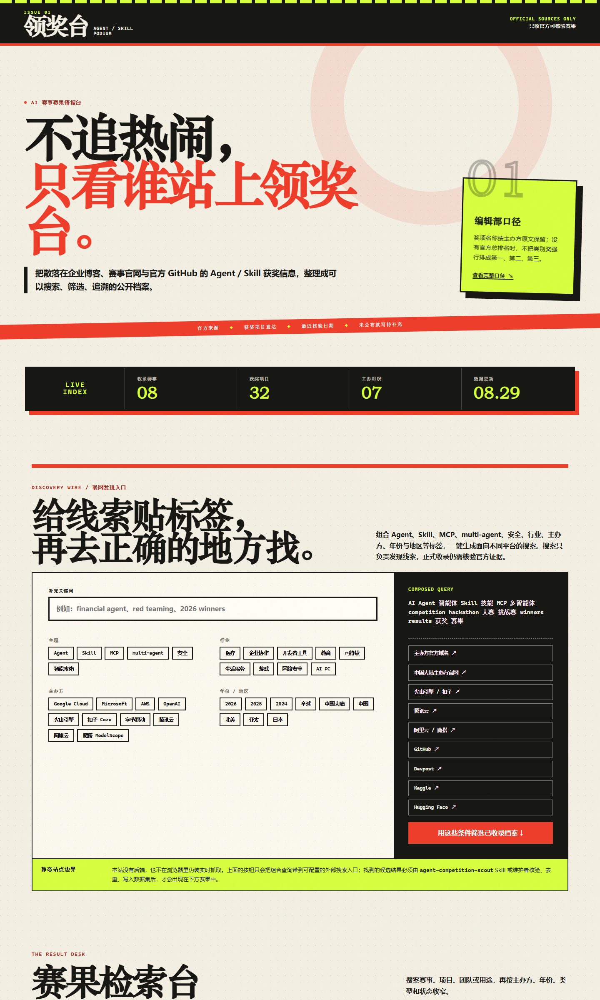
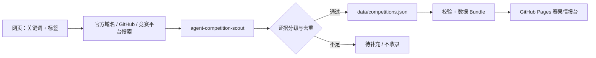

<div align="center">

# Agent / Skill 领奖台

### 不追热闹，只看谁站上领奖台。

面向 AI Agent、Agent Skill、MCP 与多智能体比赛的公开赛果情报站<br>
**官方来源优先 · 奖项口径不混排 · 核验日期可追溯**

`纯静态`　`零前端依赖`　`GitHub Pages`　`内置联网核验 Skill`

[浏览赛果](#功能) · [使用发现台](#标签化发现) · [安装 Skill](#agent-competition-scout-skill) · [提交比赛](CONTRIBUTING.md)

</div>



> 截图来自本仓库静态页面的本地实际运行结果（1440 × 2400），不是设计概念图。页面可由 GitHub Pages 原样托管。

它不制造新的“综合排行榜”，而是把散落在主办方博客、赛事官网和官方竞赛页里的获奖信息，整理成可搜索、可筛选、可追溯的数据集。仓库同时包含可安装的 `agent-competition-scout` Skill，用来联网发现候选赛事、核验官方证据并维护数据。

| 数据快照 | 已收录赛事 | 获奖记录 | 主办组织 | 最近核验 |
| --- | ---: | ---: | ---: | --- |
| `v1` | 8 | 32 | 7 | 2026-08-29 |

## 为什么需要它

AI 爆发后，企业、社区和平台举办了大量 Agent / Skill 比赛，但了解赛果仍然很费时间：

- 结果散落在不同主办方网站，搜索关键词和页面结构没有统一标准；
- 有的赛事按总排名，有的按地区、赛道或专项奖，不能简单混成一个 Top 3；
- 项目 README、社交媒体和二手盘点常常只写“获奖”或“入围”，难以判断证据强度；
- 比赛结束后链接会迁移、结果会补发，缺少核验日期就不知道信息有多新；
- 单纯自动抓取很容易把搜索摘要、参赛者自述或页面顺序误当正式名次。

这个项目把“发现”和“确认”拆开：网页让人快速搜索，Skill 负责做需要判断力的官方核验，结构化数据保存结果，网页再以统一界面呈现。



## 功能

### 赛果浏览

- 按关键词搜索赛事、项目、团队、用途与标签；
- 按主办方、年份、类型和赛果状态筛选；
- 展示官方奖项原文、明确数字名次、获奖项目与团队；
- 提供项目链接、官方结果来源和最近核验日期；
- 区分“已核验”“已核验·精选”和“待开奖”；
- 对缺少项目链接、规模数据或结果的情况明确显示待补充；
- 无搜索结果时提供可恢复的空状态。

### 标签化发现

发现台支持组合以下标签：

- 主题：Agent、Skill、MCP、multi-agent、安全、智能攻防；
- 行业：医疗、企业协作、开发者工具、教育、可持续、生活服务、游戏、网络安全、AI PC；
- 主办方：Google Cloud、Microsoft、AWS、OpenAI、火山引擎、扣子、字节跳动、腾讯云、阿里云、魔搭；
- 年份与地区：2024–2026、全球、中国大陆、中国、北美、亚太、日本。

组合后的查询可以跳转到可配置的搜索入口：全球主办方官网、中国大陆主办方官网、火山引擎 / 扣子、腾讯云、阿里云 / 魔搭、GitHub、Devpost、Kaggle 和 Hugging Face。配置位于 [`data/competitions.json`](data/competitions.json) 的 `discovery` 字段。

> 这是无后端静态站点。浏览器只负责生成和打开查询，不会绕过 CORS 实时抓取外部网站，也不会把搜索结果自动当成已验证赛果。

### Agent Competition Scout Skill

仓库根目录本身就是一个可安装 Skill：

- 从标签和用户问题生成多组联网查询；
- 优先主办方官网、官方博客、官方赛事页和官方 GitHub；
- 把来源分为 A–D 级，参赛者自述和二手榜单只作为线索；
- 区分数字名次、大奖、地区奖、类别奖和荣誉提名；
- 按主办方、赛事、届次和官方链接去重；
- 将无法确认的字段保留为 `null` 或“待补充”；
- 更新 JSON 后生成离线数据 Bundle，并运行结构与行为测试；
- 输出新增、跳过、待确认项和证据等级组成的核验回执。

安装到某个项目：

```powershell
git clone https://github.com/carpentry-liu/agent-skill-podium.git .codex/skills/agent-competition-scout
```

然后可以这样使用：

```text
使用 $agent-competition-scout 搜索 2026 年 Agent 安全和 MCP 比赛，先做只读报告，不修改数据。
```

```text
使用 $agent-competition-scout 核验最近公布的官方前三名，更新领奖台数据并给出验证回执。
```

Skill 的入口和判定口径分别位于 [`SKILL.md`](SKILL.md) 与 [`references/source-policy.md`](references/source-policy.md)。

## 当前数据

截至 2026-08-29，数据集收录以下官方材料：

### 中国大陆

- [魔搭 · AI PC Agent Skills 征文活动](https://modelscope.cn/events/242/AI%20PC%20Agent%20Skills%20%E5%BE%81%E6%96%87%E6%B4%BB%E5%8A%A8)：收录官方公布的全部 10 组最佳实践奖；官方注明排名不分先后，数据不写数字名次；
- [腾讯云 · 第二届黑客松智能渗透挑战赛](https://developer.cloud.tencent.com/article/2661083)：只收录官方复盘正文明确点名的主赛场冠军与平行赛场第一名；
- [火山引擎 / 扣子 · AI 智能体线上挑战赛](https://developer.volcengine.com/activities/7413321752799150117)：精选官方获奖表的一等奖与全部二等奖，不把同档奖项强行排序。

### 全球与其他地区

- [OpenAI · The WebMCP Challenge](https://openai.com/webmcp-challenge/)：仍在征集，赛果待公布；
- [Microsoft · Agent Academy Hackathon Winners](https://devblogs.microsoft.com/powerplatform/agent-academy-hackathon-winners/)；
- [Google Cloud · Gemini Live Agent Challenge Winners](https://cloud.google.com/blog/topics/developers-practitioners/winners-and-highlights-of-the-gemini-live-agent-challenge)；
- [Google Cloud · ADK Hackathon Winners](https://cloud.google.com/blog/products/ai-machine-learning/adk-hackathon-results-winners-and-highlights)；
- [AWS · Summit Japan 2025 生成 AI Agent Hackathon](https://aws.amazon.com/jp/blogs/news/aiagent_hackathon_report/)。

收录不代表赛事全量覆盖。阿里云、魔搭、腾讯云、火山引擎等搜索入口可以帮助继续发现候选项，但只有官方页面明确给出获奖者时才会进入数据集；每场赛事的 `verification_note` 会说明当前是完整奖单、主要奖项精选，还是待开奖。

## 数据可信度

| 等级 | 是否可证明名次 | 来源 |
| --- | --- | --- |
| A | 是 | 主办方官网或官方博客直接列出奖项与获奖者 |
| B | 是 | 能确认主办方身份的官方竞赛结果页 |
| C | 有条件 | 主办方维护的 GitHub 或官方社交公告，需要说明为何缺少更强来源 |
| D | 否 | 参赛者 README、个人主页、二手盘点、搜索摘要、点赞或 Star |

项目链接用于了解作品，不单独承担名次证明。数据不会根据奖金额度、页面顺序、项目热度或 Finalist 身份推断排名。

## 本地运行

无需安装前端依赖，直接打开 `index.html` 即可浏览。也可以启动本地静态服务器：

```powershell
python -m http.server 8000
```

然后访问 `http://localhost:8000`。

直接打开文件时，浏览器读取生成的 `data/competitions.js`；JSON 仍是唯一维护源。

## 维护数据

编辑 `data/competitions.json` 后执行：

```powershell
python scripts/sync_data_bundle.py
python scripts/validate_data.py --check-bundle
python -m unittest discover -s tests -v
node tests/test_core.js
```

校验器只使用 Python 标准库；正式 JSON Schema 位于 [`data/competitions.schema.json`](data/competitions.schema.json)。贡献新的赛事前，请阅读 [`CONTRIBUTING.md`](CONTRIBUTING.md) 和 [`references/data-schema.md`](references/data-schema.md)。

## 技术与设计

- 原生 HTML、CSS、JavaScript，无框架、无生产构建依赖；
- GitHub Pages 可直接托管；
- 编辑部 × 领奖台的情报台视觉：新闻纸、黑墨、信号红和高亮黄绿；
- 响应式布局、键盘焦点、跳转链接、ARIA live 区域和 reduced-motion 支持；
- 所有动态内容通过 DOM 文本节点写入，避免将数据直接拼成 HTML；
- Python 标准库负责数据 schema、URL、日期、重复 ID、奖项状态和 Bundle 同步校验。

## 贡献

欢迎补充官方赛事、纠正链接或更新待开奖项目。每个 PR 必须给出能直接证明奖项的官方来源，并说明核验日期和覆盖口径。详细步骤见 [`CONTRIBUTING.md`](CONTRIBUTING.md)。

## License

[MIT](LICENSE)
